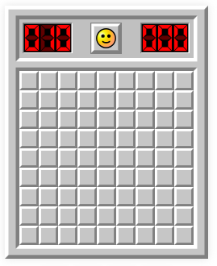

# MineSweeper

Welcome to the React MineSweeper

## Learning Objectives

- Build a Minespeeper game in React similar to [minesweeperonline](https://minesweeperonline.com/)
- Use `git` & GitHub to commit work and open a Pull Request

## Core Criteria

- Users can enter their name
- User can reset their game
- 10 by 10 board containing 10 mines
- Image on top left shows mines in game
- Image top right is a timer (optional)
- You are free to change the existing code / css

## Extended Criteria

For some of the extended criteria, pick at least 2 of the following

- Create a Highest Score Component (use state/json server/api see super extension)
- Allow board size to change with custom height, width
- Allow the user to select the number of mines in the game
- Have a countdown timer mode

## Super Extension

- Add a backend API for the Minesweeper engine, game history, scores etc using C# or Java and include a link to the repository in the Notes section below.

## Notes
